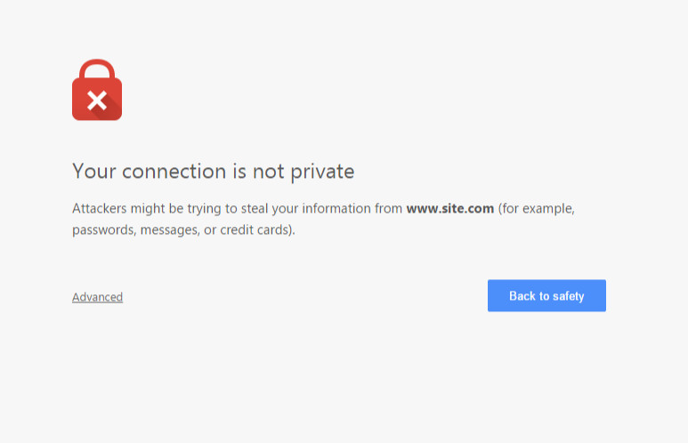

# Q-SYS QRC Tool

A web-based tool for working with Q-SYS QRC files, providing an intuitive interface for viewing, editing, and creating QRC components.

## ⚠️ Disclaimer

**This tool is not developed by, affiliated with, or endorsed by QSC, LLC or Q-SYS™.**

The Q-SYS QRC Tool is an independent, community-developed utility created to work with Q-SYS QRC files. All Q-SYS™ related trademarks, service marks, and copyrights are the property of QSC, LLC. This project is developed independently and is not certified, approved, or supported by QSC.

Users should use this tool at their own risk and discretion.

## 🌟 Features

- **QRC Visualization**: View and inspect QRC components with an interactive interface
- **QRC Editing**: Modify existing QRC files with real-time feedback
- **QRC Creation**: Build new QRC components from scratch
- **Cross-platform**: Works on any device with a modern web browser
- **Responsive Design**: Optimized for both desktop and mobile experiences

## 🚀 Quick Start

### Using the Online Version

The latest version is always available at: [https://qrc-tool.example.com](https://qrc-tool.example.com)

### Running Locally with Docker

```bash
# Pull the latest image
docker pull mikejobson/qsys-qrc-tool:latest

# Start the container
docker run -p 8080:80 mikejobson/qsys-qrc-tool:latest
```

Then visit `http://localhost:8080` in your browser.

### Building from Source

1. Clone the repository

   ```bash
   git clone https://github.com/yourusername/qsys-web-test.git
   cd qsys-web-test
   ```

2. Install dependencies

   ```bash
   npm install
   ```

3. Build the library

   ```bash
   npm run build:lib
   ```

4. Build and serve the application

   ```bash
   npm run build
   ng serve
   ```

5. Visit `http://localhost:4200` in your browser

## 🧰 Development

### Prerequisites

- Node.js 20+
- npm 10+
- Angular CLI 18+

### Development Server

Run `ng serve` for a dev server. Navigate to `http://localhost:4200/`. The application will automatically reload if you change any of the source files.

### Building

- Build library: `npm run build:lib`
- Build application: `npm run build`

### Testing

- Run unit tests: `npm test`
- Run end-to-end tests: `npm run e2e`

## 🐳 Docker

### Multi-architecture Support

This project's Docker images are built for multiple architectures:

- x86/AMD64
- ARM64

This ensures compatibility with various deployment environments, including:

- Standard cloud environments
- Raspberry Pi and other ARM-based devices
- Apple Silicon Macs

### Building Custom Docker Images

```bash
# Build for current architecture
docker build -t qsys-qrc-tool .

# Build for multiple architectures
docker buildx build --platform linux/amd64,linux/arm64 -t qsys-qrc-tool --push .
```

## 🔄 CI/CD

Continuous Integration and Deployment is managed through GitHub Actions:

- Each push to the main branch automatically:
  - Builds the library and application
  - Publishes the Docker image to Docker Hub
  - Tags the image based on version and with 'latest'
  - Deploys the app to GitHub Pages

### Demo Version

A live demo of the latest version is automatically deployed to GitHub Pages with each push to the main branch:
[https://mikejobson.github.io/qsys-qrc-tool/](https://mikejobson.github.io/qsys-qrc-tool/)

## 🔌 Connecting to Q-SYS Core Devices

### Handling Self-Signed Certificates

Q-SYS Core devices use self-signed SSL certificates for secure communications. When connecting to a Core for the first time, your browser will display a security warning. This is normal and expected.

### Steps to Accept the Certificate

Before you can use the QRC Tool with your Q-SYS Core:

1. Open your browser and navigate directly to your Core's IP address (e.g., `https://192.168.1.100`)
2. You'll see a warning similar to the one below:



3. Depending on your browser:

   - **Chrome**: Click "Advanced" and then "Proceed to [IP] (unsafe)"
   - **Firefox**: Click "Advanced", then "Accept the Risk and Continue"
   - **Safari**: Click "Show Details" and then "visit this website"
   - **Edge**: Click "More information" and then "Go on to the webpage"

4. Once you've accepted the certificate for your Core's IP address, return to the QRC Tool and proceed with your connection.

### Security Note

While accepting a self-signed certificate creates an exception in your browser, it's only valid for:

- The specific Core IP address you visited
- Your current browser

If you connect to a different Core or use a different browser/device, you'll need to repeat this process.

### Using QRC Tool with Multiple Cores

If you work with multiple Q-SYS Cores:

1. Create a bookmarks folder in your browser for your Cores
2. Visit each Core's IP directly and accept the certificate
3. After accepting all certificates, you can use the QRC Tool seamlessly with all your Cores

### Enterprise Environments

For enterprise environments with many Cores, consider:

- Setting up a proper Certificate Authority (CA)
- Installing trusted certificates on your Cores
- Consult the Q-SYS documentation on "Enterprise Certificate Management"

## 📄 License

This project is licensed under the MIT License - see the [LICENSE](LICENSE) file for details.

## 🙏 Acknowledgments

- [Q-SYS](https://www.qsys.com/) for their powerful audio, video, and control ecosystem
- Angular team for providing an excellent web application framework
- All contributors who have invested time to help with the project

## 👥 Contributing

Contributions are welcome! Please feel free to submit a Pull Request.

1. Fork the project
2. Create your feature branch (`git checkout -b feature/amazing-feature`)
3. Commit your changes (`git commit -m 'Add some amazing feature'`)
4. Push to the branch (`git push origin feature/amazing-feature`)
5. Open a Pull Request
